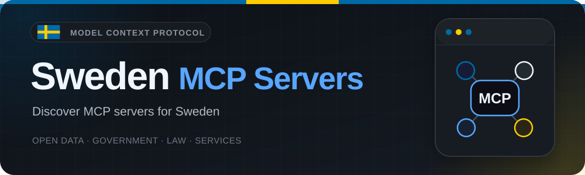

# Sweden MCP Servers 🇸🇪

<p align="center">
  
</p>

> A curated catalog of [Model Context Protocol](https://modelcontextprotocol.io/)
> servers for Swedish data, laws and services. Written in English.

<p align="center">
<!-- BEGIN:badges -->
  <a href="https://github.com/bsab/sweden-mcp-servers/actions/workflows/ci.yml"></a>
  <a href="https://github.com/bsab/sweden-mcp-servers/actions/workflows/link-check.yml"></a>
  <a href="https://github.com/bsab/sweden-mcp-servers/actions/workflows/pages.yml"></a>
  <a href="LICENSE"></a>
  
  
<!-- END:badges -->
</p>

[Explore the catalog](https://bsab.github.io/sweden-mcp-servers/) ·
[JSON API](https://bsab.github.io/sweden-mcp-servers/catalog.json) ·
[Suggest a server](https://github.com/bsab/sweden-mcp-servers/issues/new?template=new-server.yml) ·
[Contribute](CONTRIBUTING.md)

## About this repository

The **Model Context Protocol (MCP)** connects AI assistants to external tools and
sources through a standard interface. This repository is **a catalog, not an MCP
server implementation**. It lists existing public projects with a specific connection
to Swedish data or services, rather than ordinary APIs or generic integrations.

This is an independent community project, not an official Swedish government catalog.
Inclusion is not an endorsement by this catalog, the data providers or the listed projects.
Most listed integrations are community-maintained; consult their own documentation.

### Structure and attribution

The catalog structure, JSON schemas, generators, contribution workflow and static site
are adapted from [France MCP Servers](https://github.com/bsab/france-mcp-servers/tree/2b5476b610d8d4bfa5aa7b391b5f21a1d65bc9f3),
itself based on [Italia MCP Servers](https://github.com/bsab/italia-mcp-servers/tree/d564fbeb5aedfde3c6e697bc4655bf9e0897b9a0).
The original **MIT license and Copyright (c) 2026 Sab Severino** are preserved in
[LICENSE](LICENSE). This is an independent repository and catalog, without their
server entries or Git history.

## Start here

| To… | Visit… |
|-----|--------|
| Search and filter projects | [Web catalog](https://bsab.github.io/sweden-mcp-servers/) |
| Reuse the machine-readable catalog | [catalog.json](https://bsab.github.io/sweden-mcp-servers/catalog.json) |
| Understand what was actually verified | [Verification record](VERIFICATION.md) |
| Suggest a missing project | [New server form](https://github.com/bsab/sweden-mcp-servers/issues/new?template=new-server.yml) |
| Correct metadata or broken links | [Report an issue](https://github.com/bsab/sweden-mcp-servers/issues/new?template=report.yml) |
| Contribute source entries | [Contribution guide](CONTRIBUTING.md) |

### Choosing and using a server

1. Open the project's documentation and check its license, prerequisites and tools.
2. Check whether API keys, a local runtime or a paid account are required.
3. For a listed remote endpoint, use an MCP client supporting its documented transport.
4. Otherwise, review the source before following the project's installation instructions
   and configuring its launch command in your client.

A **Connect** link is an endpoint address, not a one-click installer or an uptime guarantee.
Do not send secrets or personal data to an unfamiliar server. Tool output may be incomplete
or untrusted; validate important weather, travel, legal or statistical information with
the authoritative data provider.

## Catalog

Entries are checked against canonical public documentation and implementation sources.
`last_verified` is the metadata consultation date, **not** proof that a server runs.
The [verification record](VERIFICATION.md) separates runtime results from source inspection
and explains credentials, licensing and coverage limitations.

The **🎯 Ready score /100** measures documented readiness, not popularity, security or
runtime reliability. **Unassessed does not mean zero.** Where assessed, scores link to
the criteria and evidence; entries sort by descending score, then name, with unassessed
entries last. Bold names, if present, are editorial selections, not certification.

<!-- BEGIN:catalog -->
### 📊 Data and Statistics

<table width="100%">
  <thead>
    <tr>
      <th width="23%">Project</th>
      <th width="13%" align="right">🎯 Ready score /100</th>
      <th width="6%" align="right">⭐</th>
      <th width="8%">Lang</th>
      <th width="40%">Description</th>
      <th width="10%">Link</th>
    </tr>
  </thead>
  <tbody>
  <tr>
    <td><a href="https://github.com/Namraks-Labs/mcp-sweden">MCP Sweden</a></td>
    <td align="right"><a href="servers/mcp-sweden.json" title="Documentation review: 2026-09-14; criteria and sources">Unassessed</a></td>
    <td align="right">1</td>
    <td>Python</td>
    <td>Combines Swedish data tools for SCB statistics, parliament, municipal indicators, education, radio and Stockholm public transport.</td>
    <td align="center"><a href="https://sweden.mcp.namraks.com/mcp" target="_blank" rel="noopener noreferrer" title="Open MCP endpoint: MCP Sweden"><kbd>Connect</kbd></a></td>
  </tr>
  </tbody>
</table>

### 🗺️ Geospatial and Territory

<table width="100%">
  <thead>
    <tr>
      <th width="23%">Project</th>
      <th width="13%" align="right">🎯 Ready score /100</th>
      <th width="6%" align="right">⭐</th>
      <th width="8%">Lang</th>
      <th width="40%">Description</th>
      <th width="10%">Link</th>
    </tr>
  </thead>
  <tbody>
  <tr>
    <td><a href="https://github.com/furrytailapps/mcp-lantmateriet">Lantmäteriet MCP</a></td>
    <td align="right"><a href="servers/mcp-lantmateriet.json" title="Documentation review: 2026-09-14; criteria and sources">Unassessed</a></td>
    <td align="right">0</td>
    <td>JS</td>
    <td>Provides Lantmäteriet property searches, terrain elevation, map URLs and STAC discovery for Swedish imagery and elevation datasets.</td>
    <td align="center"><a href="https://mcp-lantmateriet.vercel.app/mcp" target="_blank" rel="noopener noreferrer" title="Open MCP endpoint: Lantmäteriet MCP"><kbd>Connect</kbd></a></td>
  </tr>
  </tbody>
</table>

### ⚖️ Legal Tech and Law

<table width="100%">
  <thead>
    <tr>
      <th width="23%">Project</th>
      <th width="13%" align="right">🎯 Ready score /100</th>
      <th width="6%" align="right">⭐</th>
      <th width="8%">Lang</th>
      <th width="40%">Description</th>
      <th width="10%">Link</th>
    </tr>
  </thead>
  <tbody>
  <tr>
    <td><a href="https://github.com/AvoccadoTech/legal-mcp-sweden">Sweden Legal MCP (Lifos and Rättspraxis)</a></td>
    <td align="right"><a href="servers/legal-mcp-sweden.json" title="Documentation review: 2026-09-14; criteria and sources">Unassessed</a></td>
    <td align="right">0</td>
    <td>Python</td>
    <td>Two local MCP servers monitor Migrationsverket legal-position updates and maintain a searchable watchlist over published Swedish case law.</td>
    <td align="center">—</td>
  </tr>
  </tbody>
</table>

### 🏛️ Government and Public Finance

<table width="100%">
  <thead>
    <tr>
      <th width="23%">Project</th>
      <th width="13%" align="right">🎯 Ready score /100</th>
      <th width="6%" align="right">⭐</th>
      <th width="8%">Lang</th>
      <th width="40%">Description</th>
      <th width="10%">Link</th>
    </tr>
  </thead>
  <tbody>
  <tr>
    <td><a href="https://github.com/isakskogstad/Riksdag-Regering-MCP">Riksdag &amp; Regering MCP</a></td>
    <td align="right"><a href="servers/riksdag-regering-mcp.json" title="Documentation review: 2026-09-14; criteria and sources">Unassessed</a></td>
    <td align="right">31</td>
    <td>TS</td>
    <td>Searches Swedish parliamentary documents, members, debates and votes, plus Government Offices material exposed through g0v.se.</td>
    <td align="center">—</td>
  </tr>
  </tbody>
</table>

### 🧭 Public Services

<table width="100%">
  <thead>
    <tr>
      <th width="23%">Project</th>
      <th width="13%" align="right">🎯 Ready score /100</th>
      <th width="6%" align="right">⭐</th>
      <th width="8%">Lang</th>
      <th width="40%">Description</th>
      <th width="10%">Link</th>
    </tr>
  </thead>
  <tbody>
  <tr>
    <td><a href="https://github.com/furrytailapps/mcp-smhi">SMHI MCP</a></td>
    <td align="right"><a href="servers/mcp-smhi.json" title="Documentation review: 2026-09-14; criteria and sources">Unassessed</a></td>
    <td align="right">0</td>
    <td>TS</td>
    <td>Exposes SMHI forecasts, weather and hydrological observations, warnings, radar and lightning through a hosted MCP interface.</td>
    <td align="center"><a href="https://mcp-smhi.vercel.app/mcp" target="_blank" rel="noopener noreferrer" title="Open MCP endpoint: SMHI MCP"><kbd>Connect</kbd></a></td>
  </tr>
  <tr>
    <td><a href="https://github.com/robobobby/mcp-swedish-weather">Swedish Weather MCP</a></td>
    <td align="right"><a href="servers/mcp-swedish-weather.json" title="Documentation review: 2026-09-14; criteria and sources">Unassessed</a></td>
    <td align="right">0</td>
    <td>JS</td>
    <td>A small local MCP server returning SMHI forecast-derived current conditions and forecasts for Swedish cities or coordinates.</td>
    <td align="center">—</td>
  </tr>
  </tbody>
</table>

### 💼 Employment and Labor

<table width="100%">
  <thead>
    <tr>
      <th width="23%">Project</th>
      <th width="13%" align="right">🎯 Ready score /100</th>
      <th width="6%" align="right">⭐</th>
      <th width="8%">Lang</th>
      <th width="40%">Description</th>
      <th width="10%">Link</th>
    </tr>
  </thead>
  <tbody>
  <tr>
    <td><a href="https://github.com/DanielErikssonCoder/arbetsformedlingen-mcp-server">Arbetsförmedlingen MCP Server</a></td>
    <td align="right"><a href="servers/arbetsformedlingen-mcp-server.json" title="Documentation review: 2026-09-14; criteria and sources">Unassessed</a></td>
    <td align="right">1</td>
    <td>TS</td>
    <td>Connects to Arbetsförmedlingen and JobTech APIs for current and historical jobs, job events, occupation taxonomy and education matching.</td>
    <td align="center">—</td>
  </tr>
  </tbody>
</table>

### 🚆 Transport and Mobility

<table width="100%">
  <thead>
    <tr>
      <th width="23%">Project</th>
      <th width="13%" align="right">🎯 Ready score /100</th>
      <th width="6%" align="right">⭐</th>
      <th width="8%">Lang</th>
      <th width="40%">Description</th>
      <th width="10%">Link</th>
    </tr>
  </thead>
  <tbody>
  <tr>
    <td><a href="https://github.com/hniska/trafikverket-mcp">Trafikverket MCP</a></td>
    <td align="right"><a href="servers/trafikverket-mcp.json" title="Documentation review: 2026-09-14; criteria and sources">Unassessed</a></td>
    <td align="right">0</td>
    <td>TS</td>
    <td>Queries Trafikverket road weather, traffic cameras, incidents, traffic flow and road conditions using a locally configured API key.</td>
    <td align="center">—</td>
  </tr>
  </tbody>
</table>
<!-- END:catalog -->

## Quality and transparency

- Metadata and star counts are dated snapshots, not continuously refreshed guarantees.
- Documented tool names may be a selection, not an exhaustive runtime inventory.
- No Ready scores are assigned for this initial selection: metadata/source verification
  is separate from a complete six-criterion documentation assessment.
- The shared [rubric v1](CONTRIBUTING.md#static-documentation-assessment) uses installation
  (30), configuration (20), tools (20), compatibility (15), license (10) and limitations (5).
  A future assessment must record original notes and canonical evidence for every criterion.
- The scheduled protocol checker sends **only `initialize`**. It does not certify tool
  behavior or availability. Manual tool-call evidence, if available, is recorded separately
  in [VERIFICATION.md](VERIFICATION.md).
- Catalog code and original descriptions are MIT-licensed. Each external server and its
  upstream datasets have their own terms. `license: null` means no code license was verified;
  public source alone does not grant reuse rights.

## Repository layout

```text
servers/                 One source JSON file per listed server
schema/                  JSON Schema 2020-12 for entries and the published catalog
scripts/                 Validation, README/site generation, rubric and unit tests
scripts/templates/       Searchable static HTML catalog (no framework or backend)
.github/ISSUE_TEMPLATE/   Suggestion and correction forms
.github/workflows/        CI, scheduled link checks and GitHub Pages deployment
logo.svg                 Swedish blue/yellow catalog branding
VERIFICATION.md          Source evidence, runtime procedure and limitations
```

Only README blocks between `BEGIN`/`END` markers are generated. Narrative sections must
be maintained separately. `site/` is generated and ignored; do not commit it.

## Build and preview

Use Python 3.12 or newer in a local virtual environment, then run:

```bash
python -m pip install -r scripts/requirements.txt
python scripts/validate_servers.py
python -m unittest discover -s scripts -p 'test_*.py'
python scripts/build_readme.py
python scripts/build_readme.py --check
python scripts/build_catalog.py
python -m http.server 8000 --directory site
```

Open <http://localhost:8000/>. The browser fetches `catalog.json`, so opening the HTML
as a local `file://` URL is not supported. See [CONTRIBUTING.md](CONTRIBUTING.md) for
virtual-environment setup, deployment and the complete assessment checklist.

## Published resources

| Resource | URL |
|----------|-----|
| Browse page | <https://bsab.github.io/sweden-mcp-servers/> |
| JSON catalog (version 1) | <https://bsab.github.io/sweden-mcp-servers/catalog.json> |
| Catalog schema | <https://bsab.github.io/sweden-mcp-servers/schema/catalog.schema.json> |
| Server schema | <https://bsab.github.io/sweden-mcp-servers/schema/server.schema.json> |

CI validates entries, unit tests, generated README synchronization and the site build.
GitHub Pages builds and deploys from `main`; weekly/manual link checks separate ordinary
web links from MCP protocol requests. Deployment and external checks can fail independently.

## Contributing and license

Contributions should document a genuine Sweden-relevant MCP implementation, its canonical
sources and any access restrictions. Start with [CONTRIBUTING.md](CONTRIBUTING.md).

The catalog is available under the [MIT license](LICENSE). External projects, provider
names and datasets remain subject to their respective licenses and terms.
